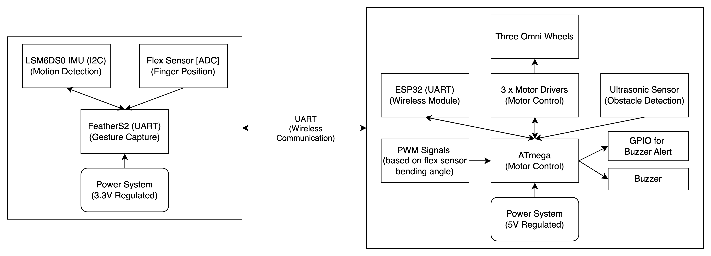
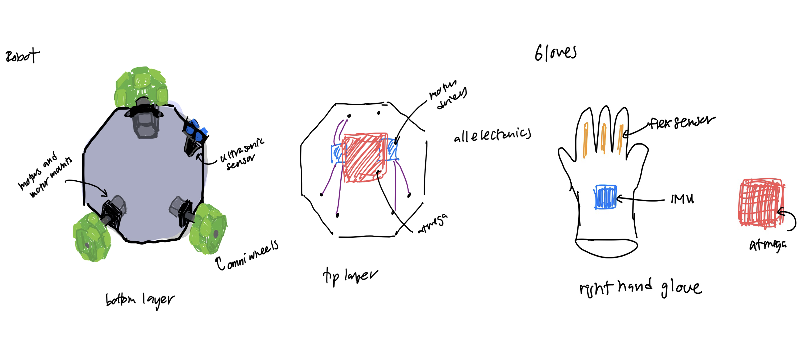
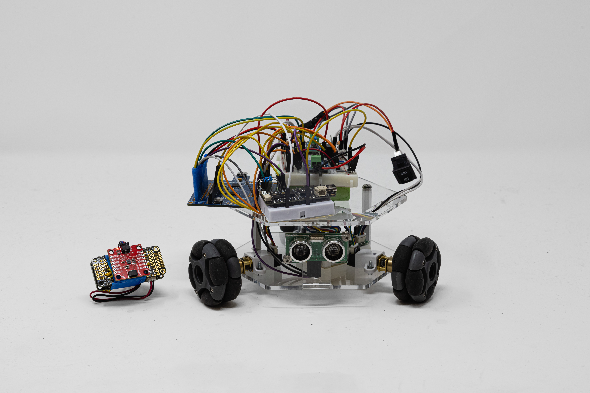
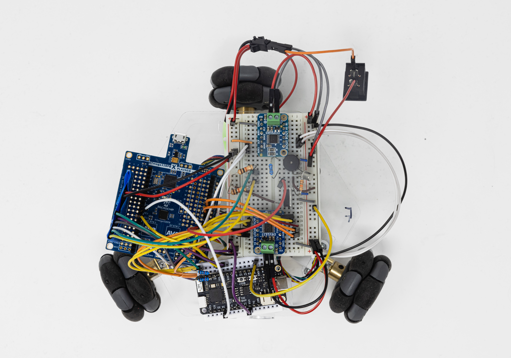
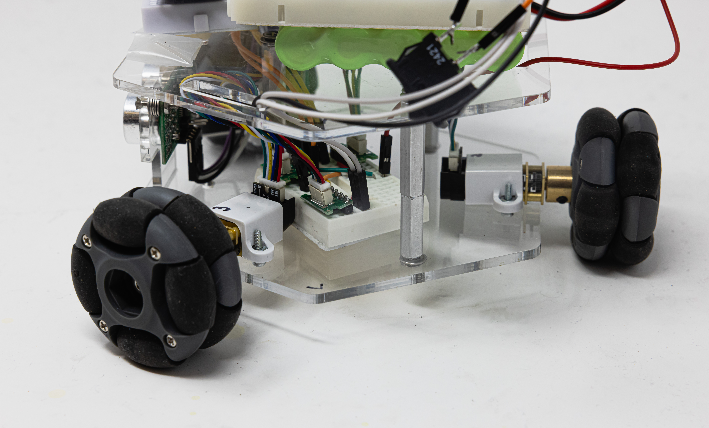
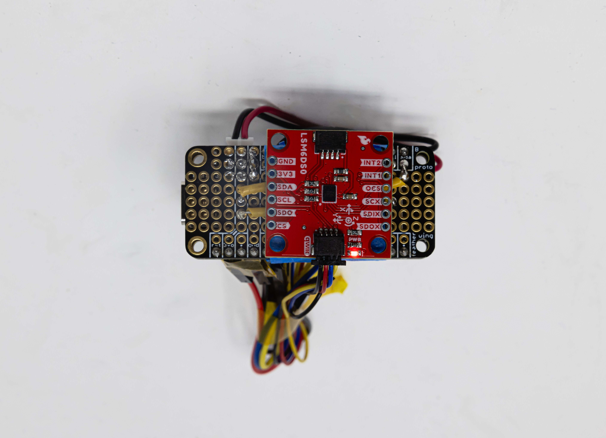

# final-project-skeleton

* Team Number: Team 9
* Team Name: Oranges
* Team Members: Izzy, Helena, and Vidhu
* GitHub Repository URL: [https://github.com/upenn-embedded/final-project-s25-oranges](https://github.com/upenn-embedded/final-project-s25-oranges)
* GitHub Pages Website URL: [for final submission]

## Final Project Proposal

### 1. Abstract

Our final project is a gesture controlled rover robot designed to enable users to control a mobile robot’s movement using intuitive hand gestures. The robot will use omni wheels for enhanced maneuverability, allowing for movement in multiple directions (forward, backward, lateral, and diagonal). Additionally, the rover will include a collision detection system using an ultrasonic sensor that triggers a buzzer/LED when obstacles are detected.

### 2. Motivation

Controlling robots using traditional joysticks or remotes can often be challenging and unintuitive, especially for new users. To address this, our project introduces a gesture-based control system that simplifies robot navigation while enhancing flexibility and precision through the use of omni wheels. The robot has the ability to move smoothly in multiple directions, including lateral and diagonal motion. Additionally, the inclusion of a collision detection system enhances the project's safety features by enabling the robot to identify and respond to nearby obstacles. These features make the project particularly valuable in practical applications like exploration and assistive robots for hazardous. The combination of intuitive gesture control and omni wheel movement offers a unique blend of precision, responsiveness, and user-friendly control.

### 3. System Block Diagram

Our system consists of two primary subsystems: the **WearableGesture Capture System** and the **Motor Control System** for the rover robot. They utilize various communication protocols including I2C, ADC, UART, PWM, and GPIO. Additionally, regulated power supplies are integrated into both subsystems to deliver stable voltage levels.

The **Wearable Gesture Capture System** is centered around FeatherS2, which manages both sensor inputs and wireless data transmission. It will handle gesture capture by interfacing with the LSM6DS0 IMU and Flex Sensor, while simultaneously transmitting control data to the rover's ESP32 module via UART.

LSM6DS0 IMU is responsible for detecting hand motion and orientation. It uses the I2C to communicate with FeatherS2. The Flex Sensor detects the degree of bending in the user's fingers, then it generates an analog voltage that is read directly by the FeatherS2’s ADC. The ADC values are mapped to speed control commands, allowing different modes of motor speed with intuitive control.

The **Rover Robot Motor Control System** is built around the ATmega328PB microcontroller, which handles motor control, obstacle detection, and alert systems. FeatherS2 here acts as a wireless receiver, communicating with the FeatherS2 in the wearable controller via UART to receive gesture and speed control data.

Motor control is achieved using three Motor Drivers that interface with ATmega. The motor drivers then manage the three Omni Wheels respectively, enabling movement in multiple directions. The ATmega generates PWM signals that control the speed and direction of the motors, with the PWM duty cycle dynamically adjusted based on the bending angle detected from the Flex Sensor and the hand motion detected from the IMU Module.

The rover also features an Ultrasonic Sensor for obstacle detection. The sensor communicates with ATmega using GPIO pins for both the Trigger and Echo signals. When an obstacle is detected within a specified range, the ATmega will activate the Buzzer via a dedicated GPIO output, alerting the user of the presence of an obstacle.

For the communication protocol, I2C links LSM6DS0 IMU to FeatherS2. The ADC on FeatherS2 is used to read variable voltage signals from the Flex Sensor. UART is employed for wireless communication between the two FeatherS2 boards. ATmega generates PWM signals to modulate motor speed and direction. GPIO connections are used for the ultrasonic sensor and the buzzer.

For power regulation, FeatherS2 requires a 3.3V regulated power supply. Meanwhile, the 5V regulated power supply in the rover system delivers stable power to the ATmega328PB, motor drivers, ultrasonic sensor, and buzzer. This separation of power systems ensures reliable performance, minimizes electrical noise, and protects components from voltage instability.

### 4. Design Sketches

For our design, the robot's base uses omni wheels for enhanced motion in multiple directions. The use of an ultrasonic sensor for obstacle detection ensures improved environmental awareness. The top layer of the robot houses all essential electronics, including the ATmega board, motor drivers, and power distribution system. On the glove controller, the IMU is positioned centrally on the back of the hand to accurately detect wrist movements, and the flex sensors are embedded along the fingers to track bending angles for speed control. We also plan to employ 3D printing and laser cutting for the motor mounts, structural supports, and the robot’s chassis.

### 5. Software Requirements Specification (SRS)

The software for the gesture-controlled rover robot will be able to process real-time motion and detect different gestures, wirelessly transmit commands, and be able to precisely control the rover. This can be broken down into three different subsystems: wearble gesture controller, rover control system, and collision detection system. The wearable gesture controller detects user gestures and transmits these movemements wirelessly. The rover control system will be able to interrept these commands and control the rover's movement using predefined gesture mappings. The collision detection system monitors the rover/s surroundings and alerts the users of any obstacles. Key requirements include gesture recognition accuracy, reliable wireless communication, precise motor control, and responsive collision detection

**5.1 Definitions, Abbreviations**

IMU (Inertial Measurement Unit): A sensor that combines an accelerometer and a gyroscope to track orientation, acceleration, and angular velocity. In this project, it is used to detect hand gestures such as tilts and wrist rolls.

Flex sensor: A sensor that changes its resistance based on the amount of bending or flexing. It is used here to detect finger position and aid in gesture control.

Feather ESP32: The wireless communication module using SPI to transmit data between the wearable controller and the robot.

Ultrasonic Sensor: A distance sensor that uses sound waves to detect objects. It is used here for obstacle detection on the robot.

**5.2 Functionality**

| ID     | Description                                                                                                                                                                                                                        |
| ------ | ---------------------------------------------------------------------------------------------------------------------------------------------------------------------------------------------------------------------------------- |
| SRS-01 | The IMU and flex sensors shall track predefined hand gestures (forward, backward, left, and right tilt, wrist roll, and open palm) within 200ms.                                                                                  |
| SRS-02 | The ATmega328PB shall process the IMU data and classify gestures based off of certain threshold values correctly.                                                                                                                  |
| SRS-03 | The ESP32 will transmit gesture data from the user to the robot with latency < 200ms.                                                                                                                                              |
| SRS-04 | The robot shall have three speed modes controlled based on the angular velocity detected from wrist rolling.                                                                                                                       |
| SRS-05 | The ultrasonic sensor shall detect obstacles within 5–100 cm. If an obstacle is within 20 cm, the robot will stop, ignore commands, and the LED will turn red. Once cleared, the robot resumes movement, and the LED turns green. |
| SRS-06 | The entire system will run independently on the ATmega328PB without the need of an external computer.                                                                                                                              |
| SRS-07 | If wireless connection is lost, the robot shall automatically stop within 500ms.                                                                                                                                                   |

### 6. Hardware Requirements Specification (HRS)

The hardware for the gesture controller rover will allow it to move freely in many directions as well as sense the motion of the controller. Additionally, it will be able to sense obstacles ahead using an ultrasonic sensor.

**6.1 Definitions, Abbreviations**

Here, you will define any special terms, acronyms, or abbreviations you plan to use for hardware

Feather ESP32: Board for wireless communication

ATMega328pb: Main microcontroller on the rover

IMU: Inertial Measurement Unit: Sensor able to detect rotations and accelerations

**6.2 Functionality**

| ID     | Description                                                                                              |
| ------ | -------------------------------------------------------------------------------------------------------- |
| HRS-01 | The rover must be able to run for at least 15 minutes continuously                                       |
| HRS-02 | The ultrasonic sensor must be able to accurately detect obstacles within 5-100 cm                        |
| HRS-03 | The motors must be able to move the rover at varying speeds                                              |
| HRS-04 | The rover must be able to move in perpendicular directions without needing to turn using the omni wheels |
| HRS-05 | The flex sensor must be able to control the speed of the rover using an ADC                              |
| HRS-06 | Motion of the IMU must translate into motion of the rover                                                |
| HRS-07 | The two ESP32 boards must be able to wirelessly communicate with each other directly                     |
| HRS-08 | The ESP32 and ATMega328pb must be able to communicate using SPI                                          |

### 7. Bill of Materials (BOM)

We need the ATMega328pb, 2 FeatherS2, the LSM6ds0 IMU, the US-10 ultrasonic sensor, 3 motors with encoders, 3 omni wheels, 3 motor drivers, flex sensor, battery pack

[https://docs.google.com/spreadsheets/d/1VVz9bghLVpC_rwVTz9ZApd166kRQwFx1JgdSo3LERfQ/edit?gid=253149064#gid=253149064](https://docs.google.com/spreadsheets/d/1VVz9bghLVpC_rwVTz9ZApd166kRQwFx1JgdSo3LERfQ/edit?gid=253149064#gid=253149064)

### 8. Final Demo Goals

On Demo Day, we will build an obstacle course for our rover to test in. Someone will wear the controller and manuver the rover around obstacles. Part of the test will include getting close to an obstacle and stopping before a collision. The test will conclude when the rover is successfully able to get to the end of the obstacle course.

### 9. Sprint Planning

*You've got limited time to get this project done! How will you plan your sprint milestones? How will you distribute the work within your team? Review the schedule in the final project manual for exact dates.*

| Milestone  | Functionality Achieved                                                                                                                                                                                                                                                                                           | Distribution of Work                                                                                                                                                                                                  |
| ---------- | ---------------------------------------------------------------------------------------------------------------------------------------------------------------------------------------------------------------------------------------------------------------------------------------------------------------- | --------------------------------------------------------------------------------------------------------------------------------------------------------------------------------------------------------------------- |
| Sprint #1  | 1. Developed Wearable Controller Prototype using the FeatherS2. 2. Implemented motion sensing algorithms with the  LSM6DS0 IMU. 3. Integrated the Flex Sensor for ADC-based speed control. 4. Developed basic motor control firmware for the ATmega using PWM signals for speed and direction. | 1. Vidhu: FeatherS2 code for IMU and Flex Sensor integration. 2. Izzy: ATmega328PB motor control firmware development. 3. Helena: Hardware setup, wiring, and initial system testing.                    |
| Sprint #2  | 1. Established UART Communication between the two FeatherS2 boards. 2. Integrated gesture detection logic with motor speed control via PWM signals. 3. Assembled hardware components: Motor Drivers, Omni Wheels, and Power Systems. 4. Conducted movement tests to verify functionality.      | 1. Vidhu: UART communication code on both FeatherS2 boards. 2. Izzy: ATmega328PB firmware to decode UART data and control motors. 3. Helena: Hardware assembly, component mounting, and test setup.      |
| MVP Demo   | 1. Developed and tested the Ultrasonic Sensor with the ATmega328PB. 2. Integrated obstacle detection logic to trigger the Buzzer via GPIO. 3. Refined gesture detection algorithms to improve accuracy. 4. Fine-tuned Flex Sensor ADC values for smoother speed control.                      | 1. Vidhu: Ultrasonic sensor and buzzer control implementation. 2. Izzy: Refinement of gesture detection code for better responsiveness. 3. Helena: Conducted thorough testing of speed control accuracy. |
| Final Demo | 1. Conducted full system integration for all subsystems. 2. Performed system calibration for accurate motion control, speed adjustment, and obstacle detection. 3. Conducted extensive performance testing for stability.                                                                           | 1. Vidhu: Final integration and calibration. 2. Izzy: Conducted performance testing and refined software logic. 3. Helena: In charge of documentation and demonstration preparation.                     |

**This is the end of the Project Proposal section. The remaining sections will be filled out based on the milestone schedule.**

## Sprint Review #1

### Last week's progress

We have designed and modeled the housing for our robot. We then laser cut the parts out of acrylic.

We have also started implementing the gesture control by working with the IMU and feather S2 to determine the acceleration and rotation of the controller. The IMU is not outputting the measurements properly so it will require further debugging.

### Current state of project

The project is coming along well. We are still waiting on the bulk of our parts to come in so we can start testing with the motors.

### Next week's plan

Finish implementing the IMU detection. We will also start testing the flex sensor ADC. We will start assembing the physical robot using the laser cut parts and the other parts if they arrive.

Vidhu will finish debugging the IMU.

Izzy will assemble the robot.

Helena will test the flex sensor.

## Sprint Review #2

### Last week's progress

The picture velow shows varying outputs of the imu (need to calibrate in code the readings).

some elementary calibration for the x acceleration showing the zero bias

The flex sensor is working with its ADC pin as PC0. The ADC reads around 300 if the flex sensor is bent straight, and reads 0 if the flex sensor is completely bent.

### Current state of project

We've assembled the mechanical part of the rover robot, where the motor are attached to the bottom plate with the motor mounts, and the omni wheels are connected to the motor. The ultra sensor is also fixed in the bottom plate. The top plate will house the atmega and the other wiring. For the electrical part, the flex sensor (connected to ADC pin PC0) is working as expected, see code: [https://github.com/upenn-embedded/final-project-s25-oranges/blob/main/flexsensor.c](https://github.com/upenn-embedded/final-project-s25-oranges/blob/main/flexsensor.c)

Since the wires for our motor haven't arrived yet, we tested with the motors in the Detkin lab, and it functions properly as expected. The connections is as follows:

For motor 1, AIN1 goes to PB1, AIN2 goes to PB2, SLP goes to 5V on ATMega, AOUT goes to Motor M1 and M2.The green terminal is 5V and ground. See code (controllong a single Detkin motor): [https://github.com/upenn-embedded/final-project-s25-oranges/blob/main/simple_working_motor_single.c](https://github.com/upenn-embedded/final-project-s25-oranges/blob/main/simple_working_motor_single.c). We followed similar wiring for the rest of the motor. Here is our motor prototype:

Here are detailed tables describing our wiring for the motors, motor driver, and ATMega328PB.

Motor Wiring:

Motor Driver Wiring:

The ultrasensor along with the active buzzer is also working. Active buzzer is connected to PD6, the trig and echo pin of ultrasensor is connected to PC1 and PC2, and we used Timer2 to control the pulse. Buzzer sounds if distance is less than 15 cm. See code: [https://github.com/upenn-embedded/final-project-s25-oranges/blob/main/ultrasensor_buzzer.c](https://github.com/upenn-embedded/final-project-s25-oranges/blob/main/ultrasensor_buzzer.c)

### Next week's plan

We will test the IMU with our calibrated code. We will also finish wiriing the motors with our motor drivers, and work on the encoding part. The electronics part should be integrating together, and we'll fix any potential conflicting issues. We will also work on EPS32 wiresless communcation

## MVP Demo

### 1. Show a system block diagram & explain the hardware implementation.

Each motor is paried with a motor driver. Our motor drivers can take up to 2 motors, so we have 2 motor drivers in total. We connected the encoder wires to the relevant ports on the motor driver as shown below in the following tables. The motor driver is also connected to the relevant timer ports on the ATMega328PB so that the PWM signals and duty cycle can be sent through. The wiring for this is also shown in the tables below. To power our entire system, we use a 6V battery. The motor driver helps make sure that enough current is supplied to the motors. We use a 5V voltage regulator to convert the 6V voltage supply to 5V to power the ATMega328PB. The buzzer and ultrasonic sensor are also connected in this ATMega328PB and the wiring is shown in the tables below,

The hardware implementation of the motors, motor drivers, and sensors are given in the above tables.

### 2. Explain your firmware implementation, including application logic and critical drivers you've written.

**Robot Movement**: 3 timers were configured to drive the motors. Timer 1 is used for Motor 1, Timer 3 is used for Motor 2, and Timer 4 is used for Motor 3. For timer 3 and 4, one PWM pin outputs variable duty cycles, and a GPIO direction pin sets motor direction (HIGH/LOW). For timer 1, there are two PWM pins to output variable duty cycles. Then we have custom functions such as move_forward(), move_backward(), move_left(), and move_right(). Each function will send different duty cycles to each wheel to control it in the four basic directions. To control the speed, the ratio of duty cycle for each wheel can be scaled up or down. We begin the robot movement by initializing all motors and calibrating the IMU sensor. Then based off the data from the IMU, we will call one of the four functions to guide the direction of the robot.

**IMU Calibration**: To implement the IMU so that the robot can move based off of the IMU tilting degree, we collected data for the x and y positions. With this data, we plotted the two datasets to see the differences in variables when we tilt the IMU and when it is stationary. We also observed that as the degree of tiling increases, the absolute value of the IMU output also increases.

Based on the above data collected, our calibrated control for IMU is:

if (x < -7500 && y > -4000 && y < 4000) → "move forward"
if (x > 7500 && y > -4000 && y < 4000) → "move backward"
if (x > -4000 && x < 4000 && y > 7500) → "move right"
if (x > -4000 && x < 4000 && y < -7500) → "move left"

**Comunication**
The ESP32 modules are able to speak to each other wirelessly over the espressif ESP-NOW protocol. Using the esp now driver from espressif we are able to send data between the two boards based on the IMU direction.

We are using I2C to communicate between the ATMega328pb and the IMU. The atmega is acting as the controller and reading the registers that contain the gyroscope and acceleration data on the IMU.

For the AtMega and ESP32 board to send data, we are working on integrating SPI to send the IMU data. Presently the SPI is not functional so the board are speaking using GPIO and a resistive ladder with an ADC. The feather will set different points on the resistive ladder high while the atmega ADC reads the voltage at the bottom. This allows the Atmega to obtain forward, backwards, left, and right direction information.

### **3. Demo your device.**

[https://drive.google.com/file/d/1towJo-rZc65AxGEO1gTTv1Kd22KoXjRQ/view?usp=sharing](https://drive.google.com/file/d/1towJo-rZc65AxGEO1gTTv1Kd22KoXjRQ/view?usp=sharing)

### 4. Have you achieved some or all of your Software Requirements Specification (SRS)?

**SRS-01 The IMU and flex sensors shall track predefined hand gestures (forward, backward, left, and right tilt, wrist roll, and open palm) within 200ms.**
We successfully calibrated the IMU so that the code can recognize what tilting motion is occurring. Based off of this, we are able to call forward, backward, left, or right moving functions to control the robot.

**SRS-02 The ATmega328PB shall process the IMU data and classify gestures based off of certain threshold values correctly.**
Our IMU is able to send gesture data to the ATMega. The ATmega is then able to classify the gesture data into four broad categories based on calibration data we measured and obtained.

**SRS-05 The ultrasonic sensor shall detect obstacles within 5–100 cm. If an obstacle is within 15 cm, the robot will stop, ignore commands, and the LED will turn red. Once cleared, the robot resumes movement, and the LED turns green.**
The ultrasonic sensor send a high to the active buzzer when an obstacle is measured within 15 cm. Hence, if an obstacle is within 15cm of the sensor that is placed at the front of our robot, the buzzer will sound. We replaced the LED with the buzzer instead because making sound is more intuitive and noticeable. We haven't integrated the ultrasonic sensor to the bulk of our robot and the main ATmega yet.

**SRS-06 The entire system will run independently on the ATmega328PB without the need of an external computer.**
We are running our robot off of the 6V battery pack we have. We have a voltage regulator to distribute 5V to the ATMega328PB.

### 5. Have you achieved some or all of your Hardware Requirements Specification (HRS)?

**HRS-01 The rover must be able to run for at least 15 minutes continuously**
We ran the robot continuously for 15 minutes while the motors moved at various different speeds. The robot was able to move for the entire period.

**HRS-02 The ultrasonic sensor must be able to accurately detect obstacles within 5-100 cm**
The ultrasonic sensor is not currently mounted on our robot, but we configured it so that it continously checks the distance and within 15 cm the robot will stop. To confirm accurate ultrasonic sensor configuration, we used uart to print to the serial terminal.

**HRS-03 The motors must be able to move the rover at varying speeds**
To move the robot in the four different directions (forward, backward, left, and right), each motor moves at varying speeds. For forward and backward, we only call motors 1 and 3 to move at the same speed in opposite directions. For left and right, all three motors are driving at different duty cycles and thus different speeds to achieve the desired direction.

**HRS-04 The rover must be able to move in perpendicular directions without needing to turn using the omni wheels**
The rover doesn't turn to go left and right. We set the front of the robot to be motors 1 and 3 and motor 2 in the back. When the robot moves left and right, it doesn't need to turn, it uses the third wheel to control the direction.

### 6. Show off the remaining elements that will make your project whole: mechanical casework, supporting graphical user interface (GUI), web portal, etc.

We laser cut the main structure of the robot, where the bottom layer houses a mini breadboard for motor drivers and the ultrasnoic sensor, and the top layer houses the main ATmega with the rest of our components. We've also cutted some space on the top layer to let wires pass through neatly. Our current robot design involves a lot of wires and chunky breadboards. We plan to solder the wires onto a proto board to reduce the weight and bulkiness of the robot. We may also add an encasing for the battery and some mounts for the proto board. We plan to use our breadboard with the feather and IMU as our wireless controller.

### 7. What is the riskiest part remaining of your project? How do you plan to de-risk this?

The riskiest part remaining of our project is the integration of all hardware and software subsystems into a unified limited-size platform. Now individual modules, including the IMU gesture detection, ultrasonic obstacle detection with buzzer, and motor control, have been verified to work in isolation. However, bringing them together is a big challenge. Also, the ATmega has limited memory, while in the future, we plan to implement an integrated algorithm takes the x and y values from IMU as input parameters and control the direction of the robot dynamically. This might exceed the available space or processing capacity of the microcontroller. Additionally, the wiring complexity poses another risk. Since we're combining multiple analog and digital sensors, motor drivers, and communication modules, the physical layout is pretty dense. Risks include fragile wire connection, robot being unstable, components falling off the board etc.

To de-risk this, we plan to prioritize early system integration testing, and combine two modules at a time to incrementally validate hardware interactions and memory usage. We are also using UART debug outputs to track system behavior. For the wiring complexity, we plan to solder the wires onto a proto board to minimize the robot’s weight and reduce bulk from loose wiring. We will also document pin mappings, timer usages, and modular breadboarding to ensure the design remains testable and maintainable.

### 8. What questions or help do you need from the teaching team?

Some Timer 3 and Timer 4 use one of the same pins, PD2, which is why timer 4 is configured to a GPIO pin to control the direction. We saw online that we could reconfigure the pin elsewhere to a pin such as PE3; however, the code to run requires some PORTMUX function which is not recognized in MPLAB and we are not sure how to fix it. This isn't too big of an issue, we were just wondering if there is a way around this.

## Final Project Report

Don't forget to make the GitHub pages public website!
If you’ve never made a GitHub pages website before, you can follow this webpage (though, substitute your final project repository for the GitHub username one in the quickstart guide):  [https://docs.github.com/en/pages/quickstart](https://docs.github.com/en/pages/quickstart)

### 1. Video

[https://drive.google.com/file/d/17KMIO_NmtMM-GU8ButMoWfOn6z9yP_SF/view?usp=sharing](https://drive.google.com/file/d/17KMIO_NmtMM-GU8ButMoWfOn6z9yP_SF/view?usp=sharing)

### 2. Images

Overall Look:

Front view:

Back view:

Top view:

Bottom Layer Details (Motors):

IMU Detail:

### 3. Results

Our final robot consisted of a three-wheel omnidrive base with an ultrasonic sensor. This robot is controlled wirelessly based off of the rotation of the controller. Here is the general breakdown of the different components on our robot.

**Motor Control**
The three motors on our robot are controlled through PWM signals using Timers 1, 3, and 4 from the ATMega328PB. Depending on which OCRA or OCRB the PWM signal is fed in, the motor will either rotate counter clockwise or clockwise. The speed of the motors can be controlled through changing the duty cycle. The advantage of our omniwheels is that our robot does not need to rotate to change directions; it can easily shift between forward, backward, left, and right.

**Communication**
The IMU is collecting the accelerometer data from the controller. This data is sent processed in the Feather ESP32 V2 and sent to the Feather ESP32 S2 on the robot, wirelessly, through the ESP-NOW protocol. The Feather on the robot then communicates the data it received to the ATMega328PB through SPI, so the robot can act accordingly.

**Controller**
The controller is composed of the IMU, which is communicating the accelerometer data to the Feather ESP32 V2 via I2C. This data was calibrated through processing several datasets of both the x and y accelerometer data depending on the tilting of the IMU. Once the IMU is calibrated, then the robot can correctly identify the tilt of the controller and act accordingly.

**Ultrasonic Sensor**
There is an ultrasonic sensor mounted on the front of our robot. When it detects a distance less than 20cm, it will sound a buzzer and will not let you move forward even if the controller is in the forward position. The robot will only be able to move back, left, and right until it is clear of the blocking object. The buzzer we are using is an active buzzer which beeps if the pin is in the HIGH state.

#### 3.1 Software Requirements Specification (SRS) Results

*Based on your quantified system performance, comment on how you achieved or fell short of your expected requirements.*

*Did your requirements change? If so, why? Failing to meet a requirement is acceptable; understanding the reason why is critical!*

*Validate at least two requirements, showing how you tested and your proof of work (videos, images, logic analyzer/oscilloscope captures, etc.).*

| ID     | Description                                                                                                                                                                                                                        | Validation Outcome                                                                                                                            |
| ------ | ---------------------------------------------------------------------------------------------------------------------------------------------------------------------------------------------------------------------------------- | --------------------------------------------------------------------------------------------------------------------------------------------- |
| SRS-01 | The IMU 3-axis acceleration will be measured with 16-bit depth every 100 milliseconds +/-10 milliseconds.                                                                                                                          | Confirmed, logged output from the MCU is saved to "validation" folder in GitHub repository.                                                   |
| SRS-02 | The ATmega328PB shall process the IMU data and classify gestures based off of certain threshold values correctly.                                                                                                                  | Confirmed, we tested and calibrated the threshold values based on the values outputted by the IMU                                             |
| SRS-03 | The ESP32 will transmit gesture data from the user to the robot with latency < 200ms.                                                                                                                                              |                                                                                                                                               |
| SRS-04 | The robot shall have three speed modes controlled based on the angular velocity detected from wrist rolling.                                                                                                                       | Not met, the robot speed is always constant for each direction                                                                                |
| SRS-05 | The ultrasonic sensor shall detect obstacles within 5–100 cm. If an obstacle is within 20 cm, the robot will stop, ignore commands, and the LED will turn red. Once cleared, the robot resumes movement, and the LED turns green. | Confirmed, the ultrasonic sensor is able to sense obstacles within 20cm and stop the robot. We chose to implement a buzzer instead of the LED |
| SRS-06 | The entire system will run independently on the ATmega328PB without the need of an external computer.                                                                                                                              | Confirmed, the robot is completely autonomous and run off of the ATMega328pb                                                                  |
| SRS-07 | If the wireless connection is lost, the robot shall automatically stop within 500 ms.                                                                                                                                              |                                                                                                                                               |

*Based on your quantified system performance, comment on how you achieved or fell short of your expected requirements.*

*Did your requirements change? If so, why? Failing to meet a requirement is acceptable; understanding the reason why is critical!*

*Validate at least two requirements, showing how you tested and your proof of work (videos, images, logic analyzer/oscilloscope captures, etc.).*

| ID     | Description                                                                                                                        | Validation Outcome                                                                                                      |
| ------ | ---------------------------------------------------------------------------------------------------------------------------------- | ----------------------------------------------------------------------------------------------------------------------- |
| HRS-01 | The rover must be able to run for at least 15 minutes continuously                                                                 |                                                                                                                         |
| HRS-02 | A distance sensor shall be used for obstacle detection. The sensor shall detect obstacles at a maximum distance of at least 10 cm. | Confirmed, sensed obstacles up to 15cm. Video in "validation" folder, shows tape measure and logged output to terminal. |
| HRS-03 | The motors must be able to move the rover at varying speeds                                                                        | Not met, the rover moves at the same speed in all directions                                                            |
| HRS-04 | The rover must be able to move in perpendicular directions without needing to turn using the omni wheels                           | Confirmed, the robot can move left and right without needing to rotate                                                  |
| HRS-05 | The flex sensor must be able to control the speed of the rover using an ADC                                                        | Not met, we decided not the implement the flex sensor                                                                   |
| HRS-06 | Motion of the IMU must translate into motion of the rover                                                                          | Confirmed, the IMU rotation corresponds to the robot moving                                                             |
| HRS-07 | The two ESP32 boards must be able to wirelessly communicate with each other directly                                               | Confirmed, the two ESP32 modules are able to communicate wirelessly                                                     |
| HRS-08 | The ESP32 and ATMega328pb must be able to communicate using SPI                                                                    | Confirmed, the feather sends IMU data to the ATMega through SPI                                                         |

### 4. Conclusion

#### 1. What did you learn from it?

One of the key takeaways from this project was the importance of thoroughly mapping out all the internal components of the ATmega328PB  before starting integration. The chip has a limited number of shared resources, such as timers, and in our final design, we ended up using four of the five timers for various functions, including motor control, SPI communication, and the buzzer for the ultrasonic sensor. Because some timers are 8-bit while others are 16-bit, and each has different capabilities, it’s crucial to plan and communicate clearly which timers are assigned to which modules. We configured timers 1, 3, and 4 for the motors because they are all 16-bit timers which would make the motor configuration mostly the same for all three motors. Without proper planning, overlap usage would likely occur which would then require significant code changes, slowing down the integration process.

Another important takeaway was learning how unpredictable embedded systems development can be. Sometimes, components fail or behave unexpectedly, and pinpointing the root cause requires extensive testing and debugging. This includes probing signals with an oscilloscope and stepping through code carefully. For instance, when none of our motors were responding during SPI integration, we eventually discovered that the uart_init() function was unintentionally reconfiguring the timers used for motor control. Once, we commented out that line, everything worked!!

#### 2. What went well?

The IMU went well in controlling the direction of the robot's motion. It was able to distinguish each direction smoothly without confusion. The ultrasensor is also detecting object accurately without making annoying unwanted noises. Since we carefully assign the timers to motors and ultrasonic sensors and that the SPI communication did not require a timer, no integration conflict happened for the timers. Some pins had to be adjusted during integration, but eventually, we're able to utilize the correct PWM pins and GPIO pins correctly. The power manaagement for the robot (6V) battery was really successfully, since we didn't need to recharge it for the entirely of our project, which proves its durability.

#### 3. What accomplishments are you proud of?

Our motors are able to transition very smoothly and react fairly between changes in directions. A big part of this was implementing *direction states* in the code. Initially, the motors would "think" every second and decide what direction they would move in. However, after implementing states, if the direction is the same, then the motors will continue to move in the same direction without stopping. This resulted in better transitions between different direction states as well as more control of the robot. Additionally, the given that it is a 3-wheel omnidrive robot, it is able to move left and right well. We implemented a drift_correction function that corrects for drift if it detects that the robot is moving left or right. This lets the robot move successfully to the left or right without making a circle.

#### 4. What did you learn/gain from this experience?

##### 5. Did you have to change your approach?

We intially intended this robot to be controlled with the movements of your hand. However, we didn't order the glove that the user would wear and where the IMU components would be mounted. We changed the design to be a small controlled

#### 6. What could have been done differently?

#### 7. Did you encounter obstacles that you didn’t anticipate?

We didn't anticipate the communication between the robot and controller to take as long as it did.

talk about how we sometimes need to switch the high and low values if we reboot the feather.

#### 8. What could be a next step for this project?

The next steps of the project can include integrating a smoother transition between different moving states of the robot. Currently, it is able to move forward, backward, left, and right and transition smoothly between these states. If we study the kinematics of a three wheel omnidrive robot more, we can implement smoother control of the robot. We can probably take the x and y vectors sent over by the IMU, and use a formula to calculate the direction of the controller, from this we can adjust the PWM and duty cycle of each motor so the robot moves in the desired direction. Additionally, the ultrasonic sensor requires a bit of thinking before it beeps and stop the robot. We could potentially integrate the sensor in a different way where it takes less time to think and can act quickly.

We can also work on reducing the bulkiness of the robot. The top of the robot has multiple breadboards to house the Feather, motor drivers, and ATMega328PB. We tried to use a protoboard to reduce the bulkiness; however, when we were testing this newly soldered, second set of components, it seemed that everything was shorting each other as the multimeter read 0V between VCC and GND. We are still unsure why this is happening, because our soldering joints were very precise and small, but we hope we can find a better solution to make the overall robot look better and weigh lighter.

## References

Fill in your references here as you work on your final project. Describe any libraries used here.
